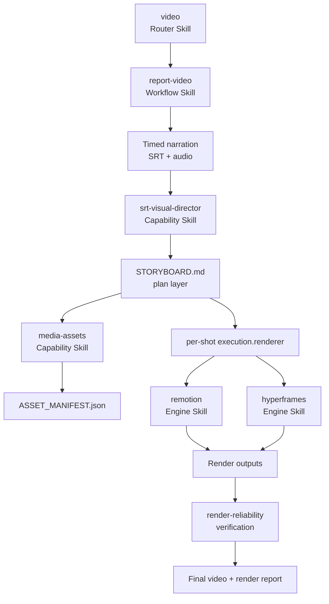

# v9-skills Foundation Design

**Status:** Implementation baseline

**Date:** 2026-09-04

**Goal:** Establish the smallest useful architecture for a composable video-agent skill toolbox before splitting or expanding `srt-visual-director`.

## Context

`v9-skills` is currently empty. The source discussion identifies a video system that must support both:

- visual, motion-heavy scenes implemented with HyperFrames (HTML/CSS/GSAP); and
- data-driven, componentized video production implemented with Remotion (React and frame-based rendering).

The system is intended to grow from a single report-video workflow into a reusable video production toolbox. The first implementation therefore defines boundaries and intermediate artifacts, rather than attempting to build a complete renderer or an exhaustive skill catalog.

## Design principles

1. **Use a flat skill namespace.** Physical directories are organized by triggerable skill name, not by the conceptual labels capability, policy, engine, or workflow.
2. **A Skill is a coherent, independently triggerable unit.** Do not create a Skill merely because a rule or future abstraction can be named.
3. **References and contracts hold durable rules.** Policies that are read by another Skill belong in `references/` unless they are independently triggerable.
4. **Scripts hold deterministic mechanics.** A script is added only when repeatability or deterministic transformation justifies it.
5. **Project artifacts carry state between Skills.** The artifact, not a prompt transcript, is the collaboration boundary.
6. **Workflow Skills compose capabilities.** A workflow owns sequencing, handoffs, stop conditions, and failure handling for a concrete deliverable.
7. **Router Skills select the next unit.** The `video` entry point routes a request to a workflow or domain Skill; it does not implement every video operation.
8. **Keep one storyboard as the plan-layer source of truth.** Story design, visual design, and per-shot renderer assignment extend the same `STORYBOARD.md`; do not create parallel storyboard documents.
9. **Do not split `srt-visual-director` before auditing its actual responsibilities.** The first version keeps its SRT-to-storyboard capability together and moves only clearly separate concerns later.

## Vocabulary and boundaries

| Object | Responsibility | Not responsible for |
| --- | --- | --- |
| Skill | A reusable, triggerable capability or orchestration unit | Hiding unrelated responsibilities behind a broad name |
| Router Skill | Chooses a relevant workflow or domain Skill from user intent and available artifacts | Rendering the entire video itself |
| Workflow Skill | Sequences Skills, manages handoffs, and defines a deliverable | Re-implementing every domain capability |
| Reference / Contract | Documents rules, formats, decisions, and invariants that callers must read | Being independently triggered without a clear use case |
| Script | Performs a deterministic, repeatable mechanical operation | Making creative or editorial decisions |
| Project Artifact | Stores the state/output of one project stage | Serving as a second hidden instruction system |
| Engine Skill | Translates an execution assignment into an engine-specific implementation | Deciding the narrative or shot intent |

## Initial namespace

The first foundation includes only the units required to make the model concrete:

```text
v9-skills/
├── docs/
│   └── architecture and implementation records
├── schemas/
│   └── machine-readable artifact contracts
├── skills/
│   ├── video/                   # Router Skill
│   ├── report-video/            # Workflow Skill
│   ├── srt-visual-director/     # SRT → semantic beats → storyboard
│   ├── media-assets/            # asset inventory, provenance, selection
│   ├── remotion/                # React/frame renderer guidance
│   ├── hyperframes/             # HTML/CSS/GSAP renderer guidance
│   └── render-reliability/      # deterministic render and QA guidance
└── docs/superpowers/
    ├── specs/
    └── plans/
```

The following are intentionally not separate Skills in this phase:

- `asset-policy` — its first rules are references owned by `media-assets`;
- `technical-director` — renderer routing is initially a contract, not a new triggerable capability;
- `storyboard` and `shot-designer` — the first audit must show repeated independent use before they are split from `srt-visual-director`;
- `health-video` and `book-video` — they are future workflow candidates, not useful placeholders.

## Video Skill Map



The `report-video` workflow is the owner of the master timeline and final composition contract. Engines implement assigned scenes; they do not decide what a shot means or whether a source is editorially valid.

## Artifact flow

```text
BRIEF
  ↓
Timed narration: audio + SRT
  ↓
srt-visual-director
  ↓
STORYBOARD.md
  ├─ narrative beat and voiceover
  ├─ visual intent and candidate assets
  ├─ time-coded shot sequence
  └─ per-shot execution.renderer / pattern
       ↓
media-assets
       ↓
ASSET_MANIFEST.json
       ↓
renderer skills (Remotion or HyperFrames)
       ↓
scene outputs + master composition
       ↓
RENDER_OUTPUT.json + video file
       ↓
render-reliability
```

### Artifact invariants

- SRT timestamps are the timing truth for narration-led work.
- A subtitle cue is not automatically a shot. The director groups cues into semantic visual units; 5–15 seconds is a starting heuristic, not a hard limit.
- `STORYBOARD.md` expresses **what** the viewer should understand and **which** visual treatment is intended. It does not contain renderer HTML, React source, or engine-specific implementation code.
- Each executable shot carries an explicit `execution.renderer` of `remotion` or `hyperframes`. A video may use both; the workflow owns the cross-engine master composition.
- Asset identity, provenance, license state, and reuse decisions are recorded in `ASSET_MANIFEST.json`, not inferred from a filename at render time.
- `RENDER_OUTPUT.json` records the produced files and verification state; it does not replace the storyboard or asset manifest.

## Renderer routing policy

The initial decision guide is deliberately small:

| Need | Preferred engine | Reason |
| --- | --- | --- |
| Kinetic typography, marker/scribble effects, title cards, chart motion, visually dense transitions | HyperFrames | HTML/CSS/GSAP is a natural motion-design surface |
| Reusable scenes, long compositions, data-driven batches, audio/subtitle/media orchestration | Remotion | React components and frame-based composition scale with repeated production |
| A video containing both kinds of shots | Both, at the shot boundary | Keep each engine focused and let the workflow own the master timeline |

The routing rule is a starting contract, not an automatic creative decision. The director supplies visual intent; the workflow or a future routing Skill applies this guide.

## Migration strategy for `srt-visual-director`

When an existing implementation is introduced, audit each instruction and file into one of four destinations:

1. keep it in `srt-visual-director` when it defines SRT interpretation, semantic grouping, narrative beats, or storyboard intent;
2. move it to `media-assets` when it defines inventory, provenance, selection, licensing, or reuse;
3. move it to an engine Skill when it is renderer-specific implementation guidance;
4. move it to `render-reliability` when it concerns disk, memory, browser, FFmpeg, concurrency, smoke renders, or output verification.

The audit is allowed to leave a rule in a focused reference rather than creating another Skill. A new Skill is justified only after the capability is independently triggerable and reused across workflows.

## Alternatives considered

### Four physical directories: `capabilities/`, `policies/`, `engines/`, `workflows/`

This is a useful conceptual model but a poor first physical layout. It encourages policy fragments and predicted future abstractions to become separate Skills, and it makes discovery depend on directory taxonomy rather than triggerable behavior.

### One monolithic video Skill

This would minimize files but would mix routing, story decisions, asset governance, engine implementation, and reliability. It would be difficult to invoke safely for a narrow request and difficult to evolve without regressions.

### Recommended: flat triggerable Skills plus references and artifacts

This keeps the runtime surface small while preserving clear contracts. It matches the observed mature pattern: workflows are Skills, domain knowledge is progressive-disclosure references, and the storyboard remains the plan layer.

## Foundation acceptance criteria

- The project documents the object model, Video Skill Map, and Artifact Flow.
- The initial Skills have valid frontmatter and non-placeholder routing instructions.
- The core JSON artifact contracts can be parsed by a standard JSON parser.
- `STORYBOARD.md` is the only plan-layer artifact defined for visual design; no parallel `execution-plan.json` is introduced.
- Renderer guidance makes the Remotion/HyperFrames boundary explicit.
- The structure can accept a later `srt-visual-director` audit without requiring a directory migration.
